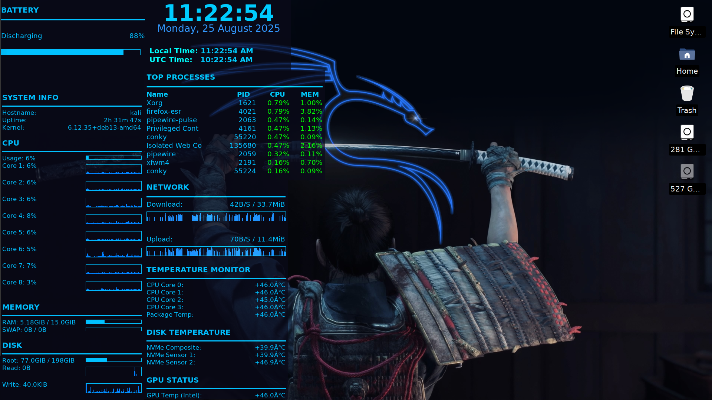

# Conky-hackerblue style

This project contains my personal Conky configuration files. Conky is a simple program that shows system information like battery, clock, and network right on your desktop.

If you experience any issues with the widget (for example, if it doesn’t display correctly or something feels off), feel free to:
Send me a DM on Twitter: @Bello_Mubarak1

# List of All Available Conky Styles and Features

- Network tab  
- Temperature tab  
- Top process tab  
- Time display  
- Battery status  
- System info  

# Screenshot of My Desktop



# Installation of Conky

```bash
sudo apt update        # or update according to your Linux distro
sudo apt install conky # or install using your distro's package manager
````

# Procedures to Setup

1. Clone the repository to your machine:

   ```bash
   git clone https://github.com/Streamcrypt/Conky-hackerblue.git
   ```
2. Change into the project directory:

   ```bash
   cd Conky-hackerblue
   ```
3. If you don't have Conky installed, install it (see Installation section above).
4. Start Conky with the included script:

   ```bash
   bash start_conky.sh
   ```
5. Check your desktop. If Conky does not appear correctly:

   * Open your file manager, find `wallpaper.png` in the project folder,
   * Right-click it and set it as your desktop wallpaper.

Now your desktop should match the setup shown in this project.

# Persistent Desktop Conky

If you want Conky to start automatically every time you boot:

1. Open your system's **Startup Applications** (or **Session and Startup**) settings.
2. Click **Add** (or **Application Autostart** → **Add**).
3. Give it a name and (optionally) a description.
4. For the command, browse to and select the `start_conky.sh` script inside your cloned `Conky-hackerblue` folder (or enter the full path), e.g.:

   ```
   /home/your-username/Conky-hackerblue/start_conky.sh
   ```
5. Make sure the entry is enabled (run on login), save, and reboot. Conky should start automatically on boot.

# Notes

* This setup is optimised for **1920 × 1080** resolution.
* Some widgets or positions may not work perfectly on other resolutions. If you find anything not working, please open an issue or post in the **Discussion** tab.


Feel free to reach out anytime!
Thank you!

```
```
